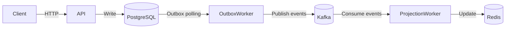
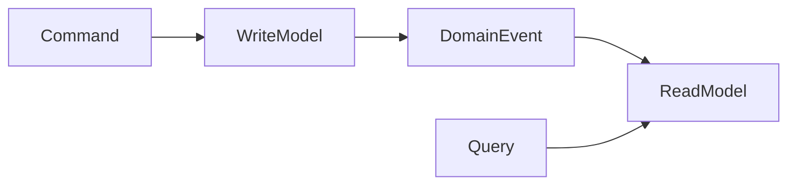
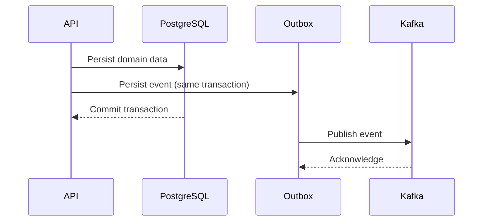
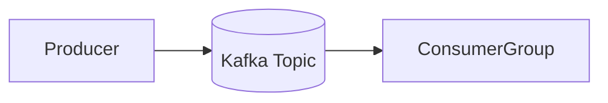
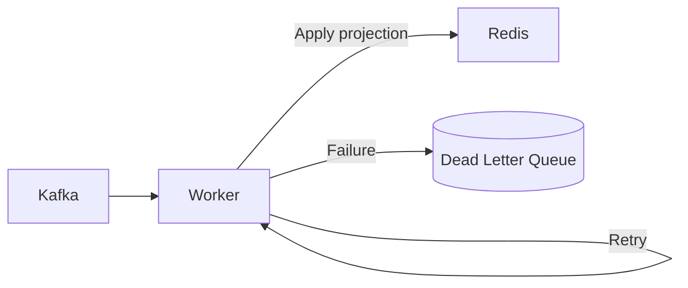

# 🏗️ System Architecture — Petri Board Arena

This document describes the **technical architecture** of the Petri Board Arena project, detailing its components, data flow, and the rationale behind key architectural decisions.

The goal of this document is to provide a **clear, engineering-focused explanation** of how the system works internally, complementing the high-level overview presented in the `README.md`.

---

## 1. Architectural Overview

Petri Board Arena follows an **event-driven architecture** using **CQRS** and **Apache Kafka** to decouple write operations from read models.

At a high level:

- Commands are handled synchronously by the API
- Domain events are persisted using the **Transactional Outbox pattern**
- Events are published to Kafka asynchronously
- Workers consume events and build read projections in Redis

---

## 2. High-Level Component Diagram

## 3. CQRS Separation

### Write Side

- Handles commands and validations
- Persists domain entities in PostgreSQL
- Emits domain events via the outbox

### Read Side

- Does not handle commands
- Consumes events asynchronously
- Stores optimized projections in Redis

### Benefits

- Independent scalability
- Clear responsibility boundaries
- Enables eventual consistency

## 4. Transactional Outbox Flow

### Why Transactional Outbox?

This pattern solves the **dual-write problem**, ensuring that:

- Database state and published events remain consistent
- No events are lost in case of failures
- Event publishing can be retried safely

## 5. Kafka Event Pipeline

### Kafka Responsibilities

- Durable event storage
- Ordered processing per partition
- Consumer group coordination
- Replay and reprocessing support

Kafka acts as the **single source of truth for events** once they leave the database.

## 6. Projection Worker Pipeline

### Worker Behavior

- Consumes events from Kafka
- Applies business projections to Redis
- Retries transient failures with backoff
- Sends irrecoverable failures to a Dead Letter Queue (DLQ)
- Commits offsets only after successful handling

---

## 7. Redis Read Model

Redis is used as a **materialized view store**.

### Characteristics

- Schema-free projections
- Optimized for low-latency reads
- Easily reset and rebuilt from events
- Supports eventual consistency

This enables fast query responses without impacting the write model.

---

## 8. Failure Handling Strategy

| Failure Type        | Strategy            |
|---------------------|---------------------|
| Transient errors    | Retry with backoff  |
| Poison messages     | Dead Letter Queue   |
| Worker crash        | Kafka offset replay |
| Redis reset         | Event reprocessing  |

This approach ensures **resilience and observability** in the event pipeline.

---

## 9. Data Consistency Model

- **Write model:** strongly consistent
- **Event stream:** eventually consistent
- **Read model:** eventually consistent

The system favors **availability and decoupling** over immediate consistency on reads.

---

## 10. Non-Goals

This architecture intentionally does **not** aim to provide:

- Exactly-once guarantees (at-least-once semantics are used)
- Cross-service distributed transactions
- Optimized cost or scale tuning

These trade-offs are deliberate to keep the project focused on **learning and clarity**.

---

## 11. Summary

Petri Board Arena demonstrates a **realistic, production-inspired architecture** using:

- CQRS
- Transactional Outbox
- Kafka-based event pipelines
- Asynchronous projections
- Redis read models

The architecture emphasizes **clarity**, **correctness**, and **learning**, making it suitable as a **technical portfolio artifact**.
